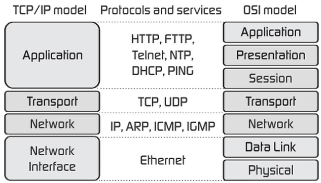

# 🌐 TCP/IP Model – Comprehensive Notes

---

## **1. Introduction**
- **TCP/IP (Transmission Control Protocol / Internet Protocol):**
  - A practical network model created by the **Department of Defense (DoD)** in the 1960s.  
  - Designed to ensure **reliable communication between heterogeneous systems** across networks.  
  - It forms the **foundation of the Internet** today.  

- **Definition:** TCP/IP is not a single protocol but a **suite of protocols** that governs how data is packaged, addressed, transmitted, routed, and received.  
- **Key Concept:** Every layer has a **specific responsibility**, and together they make end-to-end communication possible.  

---

## **2. Layers of the TCP/IP Model**
The model has **five layers**, from lowest (hardware) to highest (user interaction):  

---

### **a) Physical Layer**
- **Function:**  
  - Converts **bits (0s and 1s)** into **physical signals** for transmission across the medium.  
  - Responsible for actual **hardware transmission**.  

- **Types of Signals:**  
  - Copper wires → **electrical signals**.  
  - Fiber optic cables → **light signals**.  
  - Wireless medium → **radio waves**.  

- **Specifications Defined by this Layer:**  
  - **Topology:** how devices are physically arranged → bus, star, ring, mesh, hybrid.  
  - **Line Configuration:**  
    - **Point-to-point:** direct link between two devices.  
    - **Multipoint:** multiple devices share the same link.  
  - **Transmission Modes:**  
    - **Simplex:** one-way communication (e.g., TV broadcast).  
    - **Half-duplex:** both ways, but one at a time (e.g., walkie-talkies).  
    - **Full-duplex:** simultaneous two-way communication (e.g., telephone).  

- **Key Point:** This is where **real communication occurs**.  

---

### **b) Data Link Layer (DLL)**
- **Role:** Ensures **error-free transfer of data frames** between two directly connected nodes.  

- **Sub-layers:**  
  1. **MAC (Media Access Control):**  
     - Encapsulates network-layer packets into **frames**.  
     - Adds:  
       - **Header:** contains source & destination **MAC addresses**.  
       - **Trailer:** contains error-checking data (CRC).  
     - Example: Ethernet addressing.  
  2. **LLC (Logical Link Control):**  
     - Handles **flow control:** prevents the sender from overwhelming the receiver.  
     - Handles **error control:** detects errors in transmission using the trailer.  

- **Example:** If you send an email, the DLL ensures each frame arrives at the next node without error.  

---

### **c) Network Layer**
- **Role:** Provides **logical addressing** and determines the **best path** for data delivery.  
- **Output:** Packets (IP Packets).  

- **Main Responsibilities:**  
  - Assigns **IP addresses** to devices (logical identifiers).  
  - Finds optimal path (routing).  
  - Handles fragmentation of large packets → reassembly at destination.  

- **Protocols:**  
  - **IP (Internet Protocol):**  
    - Assigns and uses IP addresses.  
    - Splits large packets into smaller fragments.  
    - **Unreliable:** no delivery guarantee, no error correction.  
  - **ARP (Address Resolution Protocol):**  
    - Maps logical IP addresses to physical MAC addresses.  
    - Example: Resolving `192.168.1.1` → MAC `AA-BB-CC-DD-EE-FF`.  
  - **ICMP (Internet Control Message Protocol):**  
    - Reports errors (e.g., unreachable host, ping requests).  
    - Used for diagnostics.  

---

### **d) Transport Layer**
- **Role:** Ensures **end-to-end delivery of data**, flow control, and reliability.  
- **Output:** Segments (TCP) or Datagrams (UDP).  

- **Protocols:**  

  1. **TCP (Transmission Control Protocol):**  
     - **Connection-oriented:** requires a 3-way handshake before sending data.  
     - **Segmentation:** breaks large messages into smaller segments, numbers them, and reassembles at the receiver.  
     - **Reliable:**  
       - Detects errors.  
       - Retransmits lost/damaged segments.  
       - Ensures ordered delivery.  
     - Example: Web browsing, email.  

  2. **UDP (User Datagram Protocol):**  
     - **Connectionless:** no handshake; just sends data.  
     - **Unreliable:** no sequencing, error correction, or retransmission.  
     - **Faster & lightweight.**  
     - Example: Streaming video/audio, online gaming, VoIP.  

- **Key Point:** TCP = reliability; UDP = speed.  

---

### **e) Application Layer**
- **Role:** Provides **services for end users** and applications to access the network.  
- Combines OSI’s Application + Presentation + Session layers.  

- **Common Protocols:**  
  - **HTTP (Hypertext Transfer Protocol):** Access web pages/data.  
  - **HTTPS (HTTP Secure):** Secure version with encryption.  
  - **DNS (Domain Name System):** Translates domain names (e.g., google.com) → IP addresses.  
  - **SMTP (Simple Mail Transfer Protocol):** Sends emails.  
  - **FTP (File Transfer Protocol):** Transfers files between devices.  
  - **TELNET:** Remote login protocol for two-way communication.  

- **Example:** When you type `www.google.com` in a browser → DNS resolves it, HTTP fetches the content.  

---

## **3. Summary Table of TCP/IP Model**

| **Layer**        | **Main Functions**                                                            | **Protocols/Examples**                      |
|------------------|--------------------------------------------------------------------------------|---------------------------------------------|
| Physical         | Converts bits to physical signals; defines topology, line config, transmission | Copper (electrical), Fiber (light), Wi-Fi   |
| Data Link (DLL)  | Framing, MAC addressing, error/flow control                                    | Ethernet, PPP, MAC, LLC                     |
| Network          | Logical addressing, routing, fragmentation, error reporting                    | IP, ARP, ICMP                               |
| Transport        | End-to-end delivery, reliability, segmentation, flow/error control             | TCP, UDP                                    |
| Application      | User interaction, application services                                         | HTTP, DNS, SMTP, FTP, TELNET                |

---

## **4. Key Features of TCP/IP**
- **Scalable:** Works across small LANs and the global Internet.  
- **Interoperable:** Allows communication between different devices/platforms.  
- **Connection Types:** Supports both **connection-oriented (TCP)** and **connectionless (UDP)** communication.  
- **Foundation of Internet:** Every application we use (web, email, video calls) is built on TCP/IP.  

---

## **5. Quick Comparison: TCP vs UDP**
| Feature            | TCP                                   | UDP                                   |
|--------------------|---------------------------------------|---------------------------------------|
| Connection         | Connection-oriented (3-way handshake) | Connectionless                        |
| Reliability        | Reliable (error checking + retransmit)| Unreliable (no retransmission)        |
| Speed              | Slower (overhead of reliability)      | Faster (lightweight)                  |
| Order of Data      | Maintains sequence                    | No sequencing                         |
| Use Cases          | Web browsing, email, file transfer    | Streaming, VoIP, gaming               |

---

## **6. Conclusion**
- TCP/IP is the **practical, real-world networking model** that powers the Internet.  
- Each layer plays a **unique role**:  
  - Physical → transmission.  
  - Data Link → error-free frames.  
  - Network → logical addressing & routing.  
  - Transport → end-to-end reliable or fast communication.  
  - Application → user-facing services.  
- The model provides the **scalability, reliability, and flexibility** needed for today’s global communication systems.  

---
